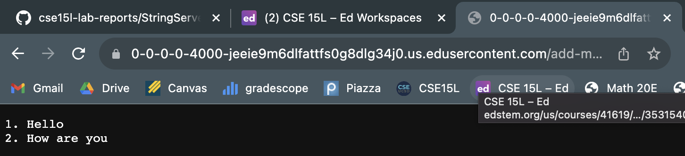

## Lab Report 2
# Servers and SSH Keys

### Part 1: `StringServer`

**Code:**

```
import java.io.IOException;
import java.net.URI;

class Handler implements URLHandler {
    String ans = "";
    int sequ = 1;

    public String handleRequest(URI url) {
        if (url.getPath().equals("/")) {
            return ans;
        } else if (url.getPath().contains("/add-message")) {
            String[] parameters = url.getQuery().split("=");

            if (parameters[0].equals("s")) {
                parameters = parameters[1].split("[+]");

                if (sequ == 1) {
                    ans += sequ + ". ";
                } else {
                    ans += "\n" + sequ + ". ";
                }

                for (int i = 0; i < parameters.length - 1; i++) {
                    ans += parameters[i] + " ";
                }

                ans += parameters[parameters.length - 1];
                sequ++;        

                return ans;
            }
        }

        return "404 Not Found!";
    }
}

class StringServer {
    public static void main(String[] args) throws IOException {
        if(args.length == 0){
            System.out.println("Missing port number! Try any number between 1024 to 49151");
            return;
        }

        int port = Integer.parseInt(args[0]);

        Server.start(port, new Handler());
    }
}
```

---

**Using `\add-message`:**


* The `handleRequest` method is called
* The argument to that method is `URI url`, which in this case was `https://<domain>/add-message?s=Hello`. With this, the if statement sees that path of the url contains `/add-message`. The message `Hello` then gets added to the `ans` and displayed on screen, with `sequ` equaling `1`.
* The method reads in the `URI` and splits the query (the part after `?`) at the `=`, causing the url to be split into a `String` array. In this case, the `Hello` gets added to the answer `String`, while the `int` that is counting the sequence increases by one.



* The `handleRequest` method is called
* The argument to that method is `URI url`, which in this case was `https://<domain>/add-message?s=How are you`. With this, the if statement sees that path of the url contains `/add-message`. The message `How are you` then gets added to the `ans` and displayed on screen below the other message that had been previously added, with `sequ` now equaling `2`.
* The method reads in the `URI` and splits the query (the part after `?`) at the `=`, causing the url to be split into a `String` array. In this case, the part that we want to add to the answer `String` then gets split again at the spaces, represented by `[+]`. Finally, `How are you` gets added to the answer `String`, while the `int` that is counting the sequence increases by one.

---

### Part 2:

Path to the *private* key for my SSH key for logging into `ieng6`:
* Path = `/Users/scarlettbova/.ssh/id_rsa`


Path to the *public* key for my SSH key for logging into `ieng6`:
* Path = `/home/linux/ieng6/cs15lfa23/cs15lfa23dx/.sshid_rsa.pub`


Terminal interaction logging into `ieng6` with my course-specific account without being asked for a password:


---

### Part 3:

One thing I learned in Lab 2 was about the remote server. It is a very cool idea that I can run things from both my home computer as well as connect remotely to the computers in the CSE basement and run commands on that computer. This entire lesson has helped me better understand software in action and how anything I code can do much more than simply run in a terminal on my computer.
