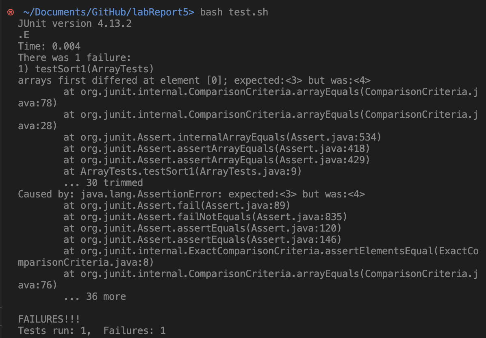

## Lab Report 3
# Bugs and Commands

### Part 1: Bugs
`ArrayExamples.java`
* A failure-inducing input for the buggy program:
  ```
  @Test
  public void testReverseInPlace2() {
    int[] input1 = {1, 2};
    ArrayExamples.reverseInPlace(input1);
    int[] ans = {2, 1};
    assertArrayEquals(ans, input1);
  }
  ```
  
* An input that doesn’t induce a failure:
  ```
  @Test
  public void testReverseInPlace1() {
    int[] input1 = {1};
    ArrayExamples.reverseInPlace(input1);
    int[] ans = {1};
    assertArrayEquals(ans, input1);
  }
  ```
  
* The symptom:
  
  
* The bug:
  ```
  // Changes the input array to be in reversed order
  static void reverseInPlace(int[] arr) {
    for(int i = 0; i < arr.length; i += 1) {
      arr[i] = arr[arr.length - i - 1];
    }
  }
  ```
* Fixed:
  ```
  // Changes the input array to be in reversed order
  static void reverseInPlace(int[] arr) {
    int temp;

    for (int i = 0; i < arr.length/2; i += 1) {
      temp = arr[i];
      arr[i] = arr[arr.length - i - 1];
      arr[arr.length - i - 1] = temp;
    }
  }
  ```

  This fixed the issue, because the code originally lost the element that was being stored in `arr[i]`. It also only needs to iterate through half of the array, since it is swapping the elements at the front half and the back to make it in reversed order, and if it went through the whole array it would be undoing the swaps that already happened.
  
---
### Part 2: Researching Commands
`grep`
* Four interesting command-line options:
  1. `-i`: This command ignores cases, meaning that it will search for any match regardless of uppercases or lowercases.
     ```
     ~/Documents/GitHub/docsearch/technical/911report> grep "ohio" -i chapter-1.txt
     The hijackers attacked at 9:28. While traveling 35,000 feet above eastern Ohio, United 93 suddenly dropped 700 feet. Eleven seconds into the descent, the FAA's air traffic control center in Cleveland received the first of two radio transmissions from the aircraft. During the first broadcast, the captain or first officer could be heard declaring "Mayday" amid the sounds of a physical struggle in the cockpit. The second radio transmission, 35 seconds later, indicated that the fight was continuing. The captain or first officer could be heard shouting:" Hey get out of here-get out of here-get out of here."
     NEADS never lost track of Delta 1989, and even ordered fighter aircraft from Ohio and Michigan to intercept it. The flight never turned off its transponder. NEADS soon learned that the aircraft was not hijacked, and tracked Delta 1989 as it reversed course over Toledo, headed east, and landed in Cleveland.
     ```
     * This searched for "ohio" even if the match had a different combination of uppercase and lowercase.

     ```
      ~/Documents/GitHub/docsearch/technical/911report> grep "commission" -i preface.txt
                people for their consideration. Ten Commissioners-five Republicans and five
                Commission on Terrorist Attacks Upon the United States (Public Law 107-306, November
                areas determined relevant by the Commission. In pursuing our mandate, we have
                Commissioners, whose dedication to this task has been profound. We have reasoned
            We want to thank the Commission staff. The dedicated professional staff, headed by
                They have conducted the exacting investigative work upon which the Commission has
                of several previous Commissions, and we thank the Congressional Joint Inquiry, whose
                whose persistence and dedication helped create the Commission. They have been with
     ```
     * This found all of the matches to "commission", since they all had an uppercase 'C'.
       
  2. `-n`: This command prints the line numbers as well as the matching lines to the search. This could be helpful if you want to reference where the match is located.
     ```
     ~/Documents/GitHub/docsearch/technical/government/Alcohol_Problems> grep "excess" -n Session3-PDF.txt
      243:and patient plans to address excessive drinking. Prototypic
      723:for excessive drinkers: the need for caution. Alcohol Alcohol
      1045:excessively. Second, the ED is a fast-paced environment in which
     ```
     * This provided the line numbers with any line that contained "excess".
 
    ```
    ~/Documents/GitHub/docsearch/technical/government/Alcohol_Problems> grep "negative cons" -n Session3-PDF.txt
    27:and other negative consequences of drinking. This review will
    60:that negative consequences can be directly linked to a behavior.17
    785:negative consequences surrounding it and that in essence we, as
    876:alcohol consumption or decreases in negative consequences, such as
    1222:alcohol-related negative consequences and injuries at 1 year.
    ```
     * This showed all of the lines and line numbers with the term "negative cons".
 
  3. `-w`: This command requires that the match is exact to the word. This is useful for searching when you don't want to see the answers that simply contain the search inside of the word.
     ```
      ~/Documents/GitHub/docsearch/technical/biomed> grep "are" -w 1471-213X-2-1.txt
        the forebrain are well documented [ 11 12 13 14 ] .
        are first joined by glia [ 15 ] and GnRH neurons [ 16 ] at
        outgrowth markers. These are the first experiments to
          of GnRH neurons are within the telencephalon by
          Antibodies that recognize chick PN-1 are not available
        (there are 24 hours between stage 17 to 21 and 60 hours
        (PAR's). These two hypotheses are not mutually exclusive
        migration. PAR'S are G-coupled receptors activated by
        PAR'S have been identified (PAR 1-4); PAR'S 1,3 and 4 are
        of the endothelium. PAR'S are expressed in the developing
        serpins are members of the same superfamily, they are
        exit from the epithelium are in place [ 15 ] . Therefore,
        during this time (stage 17-21) are irrelevant to the timing
        between a neuron and its environment are likely not
            chick are not available, we examined its localization
     ```
     * This only included lines that contain the exact word "are", instead of also printing any lines that contain words that contain "are".
       
     ```
      ~/Documents/GitHub/docsearch/technical/biomed> grep "it" -w 1471-213X-2-1.txt
          each developmental stage varies [ 22 ] , it is difficult
          axogenesis, it also had no effect on the timing of glial
          diffuse staining suggested it was also in the matrix of
        system, it remains a possibility that their activation or
        inhibitor in our system as it has been demonstrated to be
        if it is serving as a protease inhibitor, it may inactivate
        vomeronasal nerve. As with PN-1, it is also present in the
        extracellular matrix where it is likely that the
     ```
     * This printed out lines with the exact word "it".

  4. `-v`: This command prints the lines that don't contain the word. This could be useful for inverse searches.
     ```
     ~/Documents/GitHub/docsearch/technical/government/Gen_Account_Office> grep "a" -v og97032.txt   


      B-276475
      1997. 62 Fed. Reg. 10312.
      GAO/OGC-97-32
      (202) 512-8777.
      Enclosure
      ENCLOSURE
      ISSUED BY THE DEPARTMENT OF JUSTICE, IMMIGRATION AND NATURALIZATION
      SERVICE AND EXECUTIVE OFFICE FOR IMMIGRATION REVIEW ENTITLED
      "INSPECTION AND EXPEDITED REMOVAL OF ALIENS; DETENTION AND REMOVAL
      OF ALIENS; CONDUCT OF REMOVAL PROCEEDINGS; ASYLUM PROCEDURES" (RIN:
      1115-AE47)
      GAO/OGC-97-32
      executive orders
      procedures of 5 U.S.C. § 553. INS published the proposed rule on
      Responsibility Act of 1996.
      The proposed rule's request for comments resulted in 124
      comment period.
      Responsibility Act of 1996 (Pub. L. 104-208, Sept. 30, 1996).
      Executive Order No. 12866
      
      Executive Order No. 12612
      Executive Order No. 12988
      in the order.
      GAO
      
      
      B-276475.2
      (GAO/OGC-97-32).
      provision.
      Sincerely yours,
     ```
     * This printed out all of the lines that didn't contain the lowercase letter "a".
     
     ```
     ~/Documents/GitHub/docsearch/technical/government/Gen_Account_Office> grep "a" -vi og97032.txt


      B-276475
      1997. 62 Fed. Reg. 10312.
      (202) 512-8777.
      Enclosure
      ENCLOSURE
      executive orders
      procedures of 5 U.S.C. § 553. INS published the proposed rule on
      The proposed rule's request for comments resulted in 124
      comment period.
      Executive Order No. 12866
      
      Executive Order No. 12612
      Executive Order No. 12988
      in the order.
      
      
      B-276475.2
      provision.
      Sincerely yours,
     ```
     * This printed out all of the lines that didn't contain the letter "a". It ignored cases, since I did the command `-vi`.
  
Source: https://docs.rackspace.com/docs/use-the-linux-grep-command
