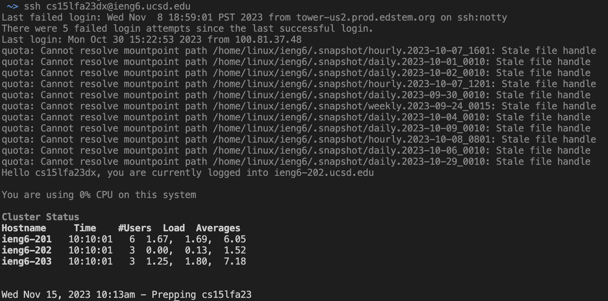
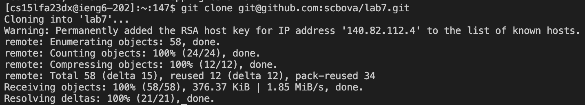
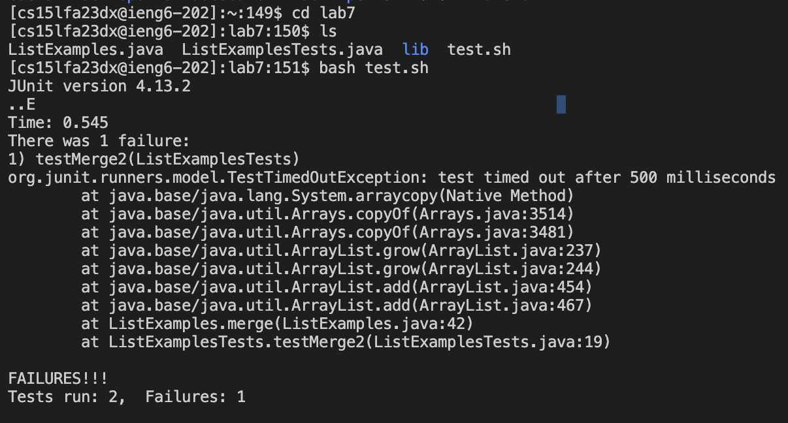
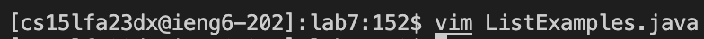
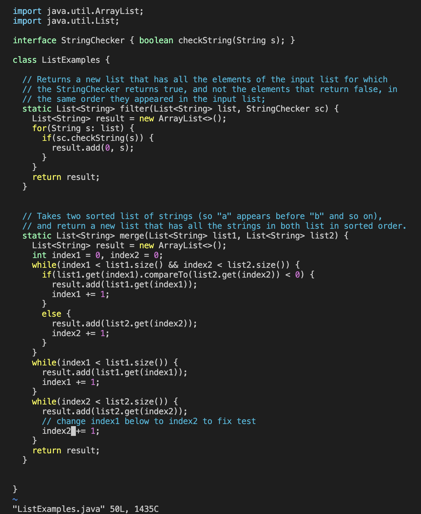
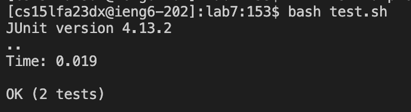
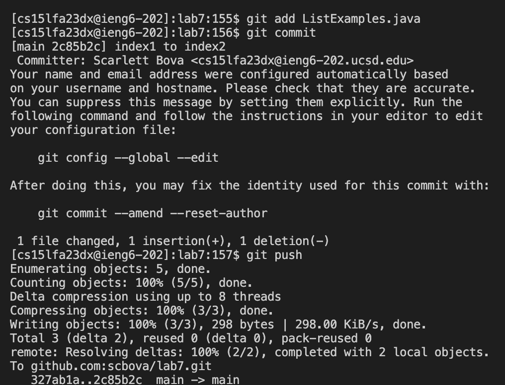
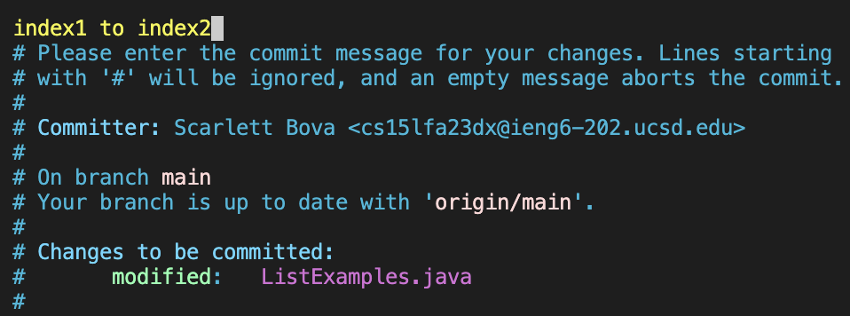

## Lab Report 4
# Vim
---
**Log into ieng6**

Keys pressed: `ssh cs15lfa23dx@ieng6.ucsd.edu<enter>`
* The `ssh` command followed by my personal account logged me into my remote account.

---
**Clone your fork of the repository from your Github account (using the `SSH` URL)**

Keys pressed: `git clone <command>v<enter>`
* I had copied the `SSH` URL from my github fork, so I had to paste it after typing `git clone`.

---
**Run the tests, demonstrating that they fail**

Keys pressed: `cd lab7<enter>`, `ls<enter>`, `bash test.sh<enter>`
* First, I had to make my working directory `lab7`. Then, I had to type `ls` to check what the test file was called. Lastly, I typed `bash` and then the test file name to run the tests.

---
**Edit the code file to fix the failing test**

Keys pressed: `vim ListExamples.java<enter>`, `/change<enter>`, `<down><right><right>xi2<esc>`, `:wq<enter>`
* I typed `vim` and then the file I wanted to fix. Then I typed a `/` to do a search on the file, and typed in `change` to find the line above the code that needs to be fixed. Then I pressed `<enter>` to access that line, then I went to the line and specific character that I wanted to change, which was the `1` of `index1`. I deleted `1` using `x`, and then went into insert mode with `i` and added a `2` to the end of `index`. To save my changes, I exited out of insert mode using `<esc>`, and then saved and exited by typing `:wq`.

---
**Run the tests, demonstrating that they now succeed**

Keys pressed: `<up><up><enter>`
* The `bash test.sh` command was 2 up in command history, so all I needed to do was go up twice to find it.

---
**Commit and push the resulting change to your Github account**

Keys pressed: `git add ListExamples.java<enter>`, `git commit<enter>`, `iindex1 to index2<esc>`, `:wq<enter>`, `git push<enter>`
* First I added the changes using `git add`. Then I started a commit with `git commit`. To write my commit message, I went into insert mode with `i`, and then typed my commit message and `<esc>` to go back to normal mode. To save my commit, I typed `:wq`. Lastly, I pushed the change to github with `git push`.
