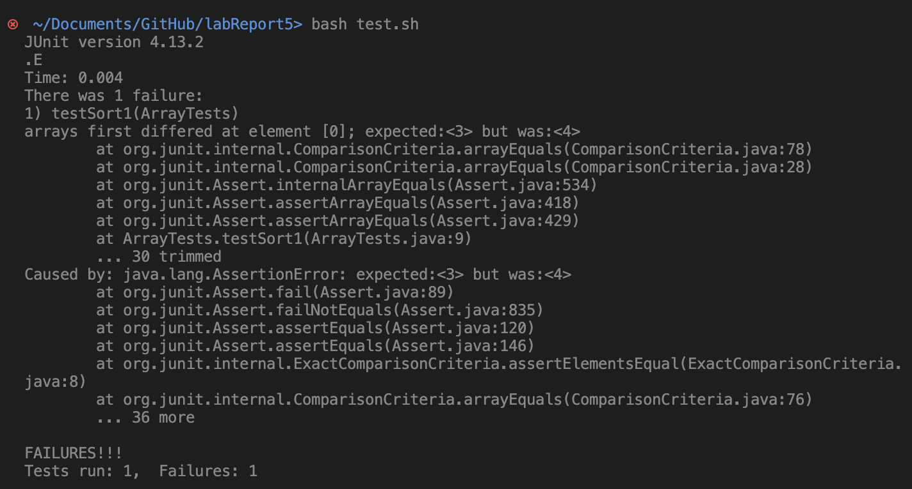
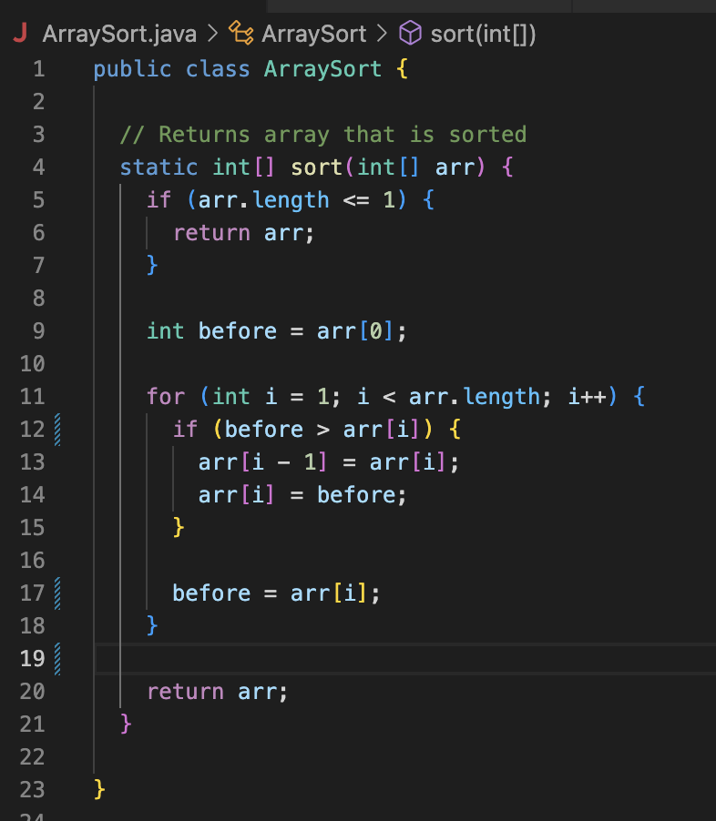
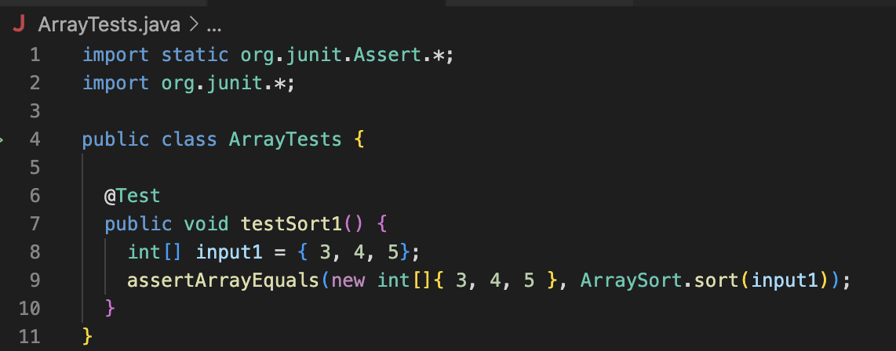
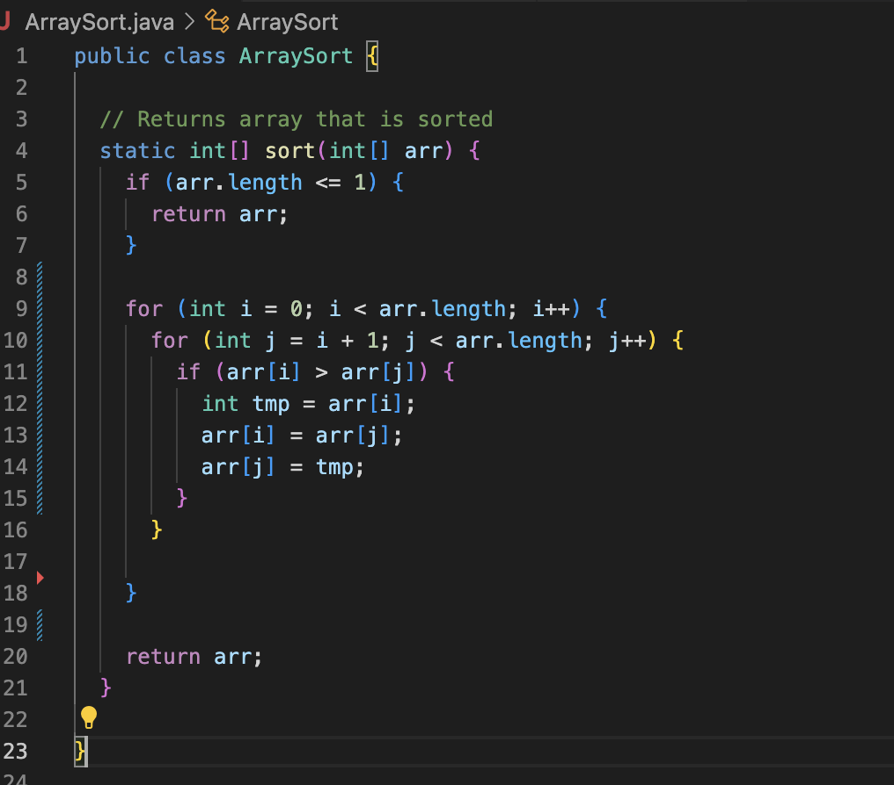
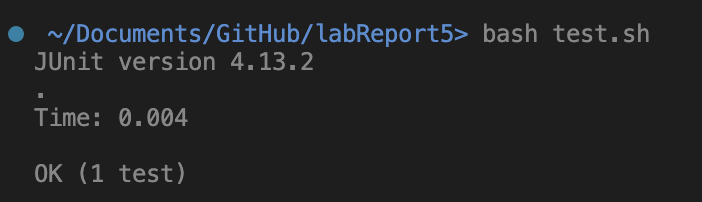

## Lab Report 5
# Putting it All Together
---
# Debugging Scenario

**Original Post From Student on EdStem**  
> **Title:** Not sure what is wrong with my `ArraySort` method  
> **Post:** I made a method to sort an Array of ints. However, it doesn't work, and I'm not sure why. The symptom that the terminal is showing is the failure of my test, shown in the first screenshot. I think the bug is within the if-statement, causing it to not swap the correct spots. I think I might either need to decrement i if swapped, so that each element is compared, or maybe create a temporary int. My failure inducing input was {5, 4, 3}.  
> Symptom:  
   
> Code:  
   
> JUnit test that caused failure:  
   

**TA Response**
> **Reply:** Hi there! You are onto something when you realized that each element isn't being compared. Perhaps you could use another for loop to keep comparing elements. You are also onto something when you said creating a temporary int. You might want to try creating a temporary cell only inside of the if-statmenet, which would then get rid of your need for `before`.

**Student Follow-Up**
> Thank you, I realize now that I was only comparing adjacent cells, and each cell could only be swapped once to the cell before it or after it. I added a nested for-loop to keep comparing cells.


> **File and Directory structure:**  
> ```
> labReport5/
> |- lib/
>   |- hamcrest-core-1.3.jar
>   |- junit-4.13.2.jar
> |- ArraySort.java
> |- ArrayTests.java
> |- test.sh
> ```
>     
> **Contents of each file before fixing bug:**  
> `ArraySort.java`  
> ```
> public class ArraySort {
>     // Returns array that is sorted
>    static int[] sort(int[] arr) {
>       if (arr.length <= 1) {
>           return arr;
>       }
>       int before = arr[0];
>       for (int i = 1; i < arr.length; i++) {
>           if (before > arr[i) {
>               arr[i - 1] = arr[i];
>               arr[i] = before;
>           }
>           before = arr[i];
>       }
>       return arr;
>   }
> }
> ```
>   
> `ArrayTests.java`
> ```
> import static org.junit.Assert.*;
> import org.junit.*;
> public class ArrayTests {
>     @Test
>    public void testSort1() {
>       int[] input1 = {5, 4, 3};
>       assertArrayEquals(new int[]{ 3, 4, 5 }, ArraySort.sort(input1));
>   }
> } 
> ```  
>   
> `test.sh`
> ```
> javac -cp .:lib/hamcrest-core-1.3.jar:lib/junit-4.13.2.jar *.java
> java -cp .:lib/hamcrest-core-1.3.jar:lib/junit-4.13.2.jar org.junit.runner.JUnitCore ArrayTests
> ```
>   
> **Line to trigger bug:**  
> `bash test.sh` which set off the junit test that caused the bug  
>   
> **Bug fix:**  
> I had to add a nested for loop to keep comparing elements. I also needed to start the outer loop at 0, since I got rid of `before` and created a `tmp` inside of the if-statement instead.  
> Updated code:  
> ```
> public class ArraySort {
>     // Returns array that is sorted
>    static int[] sort(int[] arr) {
>       if (arr.length <= 1) {
>           return arr;
>       }
>       for (int i = 0; i < arr.length; i++) {
>           for (int j = i + 1; j < arr.length; j++) {
>               if (arr[i] > arr[j]) {
>                   int tmp = arr[i];
>                   arr[i] = arr[j];
>                   arr[j] = tmp;
>               }
>           }
>       }
>       return arr;
>   }
> }
> ```

---
# Reflection  

One cool thing I learned in lab was `vim`. I had no idea it existed before this class, and it was interesting being able to edit code in a different way than before. I don't necessarily enjoy using it, but it is still somewhat interesting.


