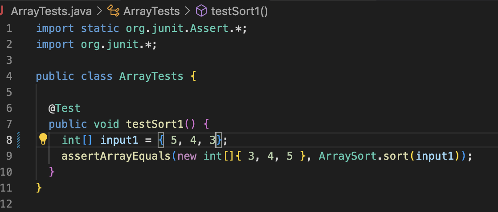

## Lab Report 5
# Putting it All Together
---
# Debugging Scenario

**Original Post From Student on EdStem**  
> **Title:** Not sure what is wrong with my `ArraySort` method  
> **Post:** I made a method to sort an Array of ints. However, it doesn't work, and I'm not sure why. The symptom that the terminal is showing is the failure of my test, shown in the first screenshot. I think the bug is within the if-statement, causing it to not swap the correct spots. I think I might either need to decrement i if swapped, so that each element is compared, or maybe create a temporary int. My failure inducing input was {3, 4, 5}, which is already sorted and doesn't even need to be changed.  
> Symptom:  
>   
> Code:  
>   
> JUnit test that caused failure:  
>   

**TA Response**
> **Reply:** Hi there! Have you double checked that everything is being assigned correctly? To do this, you could add print statements
